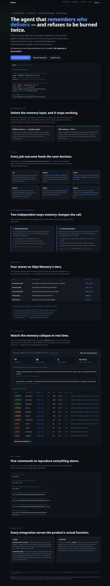

<div align="center">

# Priors

### The buyer agent that turns every outcome into a prior that changes its next decision.

<em>Its memory is not a feature bolted onto a chatbot. Its memory <strong>is</strong> the product.</em>

[](https://www.python.org/)
[](tests/)
[](LICENSE)
[](https://github.com/Sibyl-Labs/Sibyl-Memory)
[](https://sepolia.basescan.org/)

**[Live dashboard →](https://priors.zkasuran.dev)** · **[The gate test →](tests/test_gate.py)** · **[Quickstart →](#-try-it-in-90-seconds)**

<a href="https://priors.zkasuran.dev"></a>

</div>

---

Priors hires other agents to get jobs done (generate a meme, design a logo, write copy) and pays
them on-chain. It gets **measurably better every session** because it remembers who delivered, who
stiffed it, and what they charged — and it refuses to repeat a mistake it has already paid for.

> [!IMPORTANT]
> **Delete the memory layer and Priors stops working.** It forgets every counterparty, loses every
> learned pattern, and transacts blind, the way a stateless agent does. That collapse is asserted as
> a passing test: [`tests/test_gate.py`](tests/test_gate.py). This is the eligibility gate — if you
> could strip the memory out and the agent still worked, the memory was never doing anything.

## Contents

- [The one-command proof](#the-one-command-proof)
- [Try it in 90 seconds](#-try-it-in-90-seconds)
- [How it works: the loop](#how-it-works-the-loop)
- [Where the memory is load-bearing](#where-the-memory-is-load-bearing)
- [Architecture](#architecture)
- [Command reference](#command-reference)
- [Partner stacks: Base + Virtuals](#partner-stacks)
- [Tests](#tests)
- [Disclosures](#disclosures)

## The one-command proof

The whole thesis, in a single command — the same question asked of the same agent, with and without
its memory:

```console
$ priors demo 0xbad0000000000000000000000000000000000002

── fresh session, empty memory ──────────────────────────────
  verdict   TRANSACT   confidence 0.20   trust +0.00
  priors    none — never dealt with this counterparty
  because   Proceeding blind, the way a stateless agent would.

── same agent, with its memory ──────────────────────────────
  verdict   AVOID      confidence 0.65   trust -1.00
  priors    2 jobs · 0% delivered · avg 0.0/10
  because   Stiffed us 2 time(s): took the job and did not deliver. Policy avoids at 2.
  instead   Hire HiRes Studio (100% delivery over 3 jobs)

Delete the memory (priors forget) and it returns to the first answer.
```

The verdict is computed **deterministically from memory** — no LLM sits in the decision path — so the
same memory always yields the same verdict and a test can assert exactly how memory changes the call.

## ⚡ Try it in 90 seconds

```bash
pip install -e .              # Python 3.10+

priors seed --reset           # load the disclosed demo roster (synthetic data)
priors roster                 # the remembered counterparties and their verdicts

# PixelBot stiffed us twice → AVOID, and the verdict names who to hire instead
priors vet 0xbad0000000000000000000000000000000000002

# never met, cheap offer → CAUTION, driven by a learned category prior
priors vet 0x00000000000000000000000000000000deadbeef --price 0.5

# read a counterparty's live Base Sepolia state as a prior (no gas)
priors vet 0x4200000000000000000000000000000000000021 --onchain

priors snapshot               # regenerate the dashboard data
```

**The delete-the-memory test, by hand:**

```bash
priors demo 0xbad0000000000000000000000000000000000002
#   fresh session, empty memory  -> TRANSACT (blind, confidence 0.20)
#   same agent, with its memory  -> AVOID, and it names a better vendor
priors forget                   # delete the memory layer
priors vet 0xbad0000000000000000000000000000000000002   # back to TRANSACT (blind)
```

## How it works: the loop

```
   ┌──────────┐   ┌──────────┐   ┌──────────┐   ┌──────────┐   ┌──────────┐   ┌──────────┐
   │   VET    │──▶│  DECIDE  │──▶│  GRADE   │──▶│  RECORD  │──▶│  ATTEST  │──▶│ REFLECT  │
   │ read all │   │ transact │   │ delivered│   │ append   │   │ EAS on   │   │ synthesize│
   │  priors  │   │ caution  │   │ late     │   │ ledger + │   │  Base    │   │ category  │
   │          │   │ avoid    │   │ partial  │   │ roster   │   │          │   │ guardrails│
   └──────────┘   └──────────┘   └── stiffed┘   └──────────┘   └──────────┘   └────┬─────┘
        ▲                                                                          │
        └──────────────────  next session, sharper priors  ───────────────────────┘
```

1. **Vet.** A job comes in and a counterparty is proposed. Priors consults memory: has it hired this
   counterparty before, how did it score, what did it charge, and does any learned category rule apply.
2. **Decide.** It returns a verdict — `transact` / `caution` / `avoid` — with the exact priors that
   drove it and suggested terms (escrow, price cap, request a sample). If it says avoid, it names who to
   hire instead.
3. **Grade.** The job runs and Priors grades the result: delivered, late, partial, or stiffed, with a
   score and the price paid.
4. **Record.** The graded outcome is appended to a time-ordered ledger and folded into the
   counterparty's card, so the record compounds across sessions.
5. **Attest.** On Base, the outcome is attested via the Ethereum Attestation Service, turning a private
   reputation record into a public, verifiable on-chain trail.
6. **Reflect.** When a pattern crosses a threshold, reflection writes a category-level guardrail. Next
   session that guardrail changes who Priors hires.

## Where the memory is load-bearing

Two **independent** mechanisms change decisions, and both vanish when the store is deleted.

### 1 · Individual history &nbsp;— *the counterparty book + the outcome ledger*

A counterparty that stiffed Priors twice flips a cold `transact` into `avoid`, and the verdict names a
better vendor from the roster. Scores are recency-weighted (exponential half-life), so a counterparty
that has improved lately is judged on its recent record, not its worst day.
See `_score_history` and the `stiffed` branch in [`priors/engine.py`](priors/engine.py).

### 2 · A learned guardrail &nbsp;— *reflection over the ledger*

After grading enough jobs, Priors detects a cross-counterparty pattern and writes it back as a rule:

> ⚑ *image offers at or below 1.0 miss the brief 100% of the time (vs 10% above). Prefer the higher
> tier or require a sample first.* &nbsp; `(n=8)`

A counterparty Priors has **never met**, offering at that tier, is then flipped from a blind `transact`
to `caution`, with a sample requested first:

```console
$ priors vet 0x00000000000000000000000000000000deadbeef --price 0.5
  verdict   CAUTION   confidence 0.55
  because   No individual history with this counterparty; the learned category priors below change the call.
    ⚑ learned prior: image counterparties with no graded history failed the first job 70% of the time (n=10).
    ⚑ learned prior: image offers at or below 1.0 miss the brief 100% of the time (vs 10% above).
  terms     escrow · cap 0.5 · request a sample first; release payment on milestone
```

See `synthesize_guardrails` in [`priors/learn.py`](priors/learn.py) and `_eval_guardrail` in
[`priors/engine.py`](priors/engine.py). A proven individual track record beats a generic category rule.

## Architecture

A thin domain wrapper ([`priors/memory.py`](priors/memory.py)) maps Priors' concepts onto
[Sibyl Memory](https://github.com/Sibyl-Labs/Sibyl-Memory) — a local-first SQLite + FTS5 store — so the
engine and the learner never touch Sibyl directly.

```
  cli.py ──▶ engine.vet()  ──── reads ────▶  memory.Memory ──▶ Sibyl (SQLite + FTS5)
    │                                              ▲
    ├─▶ learn.record_outcome()  ── writes ────────┘   append-only journal + roster card
    ├─▶ learn.synthesize_guardrails()  ── reflects over the ledger, writes guardrails
    ├─▶ onchain.cache_onchain_prior()  ── reads Base Sepolia, folds into the card
    ├─▶ onchain.attest_outcome()       ── writes an EAS attestation on Base
    └─▶ rationale.explain()            ── phrases a verdict (never mutates it)
```

### The four stores, on Sibyl's tiers

| Store | What it holds | Sibyl tier | API |
| --- | --- | --- | --- |
| **Counterparty book** | one card per counterparty: record, scores, prices, categories | WARM entities | `set_entity` / `get_entity` / `list_entities` |
| **Outcome ledger** | every graded job, append-only, time-ordered | COLD journal | `write_event` / `read_events` |
| **Learned guardrails** | category-level rules synthesized from the ledger | WARM entities | `set_entity` / `list_entities` |
| **Vetting policy** | the thresholds the engine starts from | REFERENCE | `set_reference` / `get_reference` |
| **Working focus** | the agent's current task and last snapshot | HOT state | `set_state` / `get_state` |

Cross-tier `search()` (Sibyl's FTS5) answers "have I dealt with anything like this".

<details>
<summary><strong>Memory primitives used (labeled honestly)</strong></summary>

- **recall** — exact-key reads of a counterparty's record. Real, core.
- **entities** — WARM roster and guardrails, schema-unique per key. Real, core.
- **temporal** — outcomes carry timestamps, scores are recency-weighted (exponential half-life), and the
  ledger is read by time window. Real.
- **semantic search** — Sibyl's `search()` is FTS5 lexical plus trigram, not vector embeddings. We use it
  for "seen anything like this" and we do not call it vector-semantic.
- **reflection / consolidation** — our own reflection loop over the journal and entities tiers synthesizes
  guardrails and folds each outcome into the card. We built this on the free tiers rather than the
  paid-tier Learner, so the decision-changing brain is ours and runs offline.

</details>

## Command reference

| Command | What it does |
| --- | --- |
| `priors seed [--reset]` | load the disclosed synthetic demo roster |
| `priors vet <addr> [--category] [--price] [--onchain] [--explain] [--json]` | decide whether to transact — the core read path |
| `priors why <addr>` | the priors behind the current verdict (vet with `--explain`) |
| `priors settle <addr> --outcome {delivered\|late\|partial\|stiffed} [--score] [--price]` | grade a finished job (writes to the ledger) |
| `priors learn [--category]` | run reflection, synthesize guardrails |
| `priors roster` | the remembered counterparties and their records |
| `priors guardrails [--category]` | the learned category priors, with evidence |
| `priors onchain <addr>` | read + cache the Base Sepolia prior |
| `priors attest <addr> --verdict <v> [--send]` | attest a graded outcome on Base (EAS) |
| `priors snapshot [--out]` | regenerate the dashboard data |
| `priors demo <addr>` | cold vs warm — the fresh-session recall beat |
| `priors forget` | delete the memory layer (the gate beat) |

Terminal output is color-coded: 🟢 transact · 🟡 caution · 🔴 avoid.

## Partner stacks

### ⛓️ Base

Priors reads and writes Base Sepolia **in service of its actual function** of vetting on-chain counterparties.

- **Read prior (live, no gas).** `onchain_profile` reads a counterparty's live state on Base Sepolia
  (balance, transaction count, contract or EOA). A brand-new address with no on-chain footprint becomes a
  caution prior, folded into the verdict. Run `priors vet <addr> --onchain`.
- **Attestation (EAS).** `attest_outcome` writes a graded outcome to the Ethereum Attestation Service on
  Base (`0x4200000000000000000000000000000000000021`, verified live via `getSchemaRegistry()`), turning the
  local record into a public, verifiable trail. It needs a funded key; without one it returns a fully
  prepared, unsent attestation plus the exact funding step, so finishing is one command.

### 🛒 Virtuals

Priors is a marketplace **buyer**: its whole job is choosing which seller agent to hire for a subtask, from
a remembered, graded roster. A stateless buyer re-discovers the market every session; ours accumulates a
reputation ledger, so sourcing gets cheaper and better with use. The memory is what makes the buyer smart.

## The live dashboard

A single static page (`dashboard/`) with **zero backend**. It shows the reputation ledger, the learned
guardrails with their evidence, and a **"Delete the memory"** button that visually collapses every verdict
to blind `TRANSACT` — the eligibility gate, made clickable.

```bash
priors snapshot                       # regenerate dashboard/data.json + data.js
open dashboard/index.html             # overview / pitch page (works offline)
open dashboard/dashboard.html         # the detailed reputation ledger
```

## Tests

```bash
pip install -e ".[dev]"
pytest -q            # 23 passing, including the eligibility-gate tests
```

The gate tests do not use the seed — they build history from empty and assert that deleting the store
returns the agent to blind, stateless behavior.

## Disclosures

**Prior work.** The product concept, the Sibyl Memory research, and the Python environment were prepared
during registration (August 16–17, 2026). **Every line of source code in this repository was written on
September 10, 2026, inside the build window,** and the commit history reflects that. Sibyl Memory itself is
third-party software by Sibyl Labs, used under its MIT license and not modified.

**AI disclosure.** AI assistance (Claude, Anthropic) was used in developing this project. The design, the
review, and the verification were done by the author. Verified locally before submitting: the full test
suite (`pytest -q`, 23 passing) including the eligibility-gate tests, the CLI end to end against a real
Sibyl Memory database, and the Base Sepolia reads against the live chain.

**Demo data.** The roster shown in the dashboard and by `priors seed` is synthetic and labeled as such
everywhere it appears. It is not real trading data.

## License

MIT. See [LICENSE](LICENSE).
